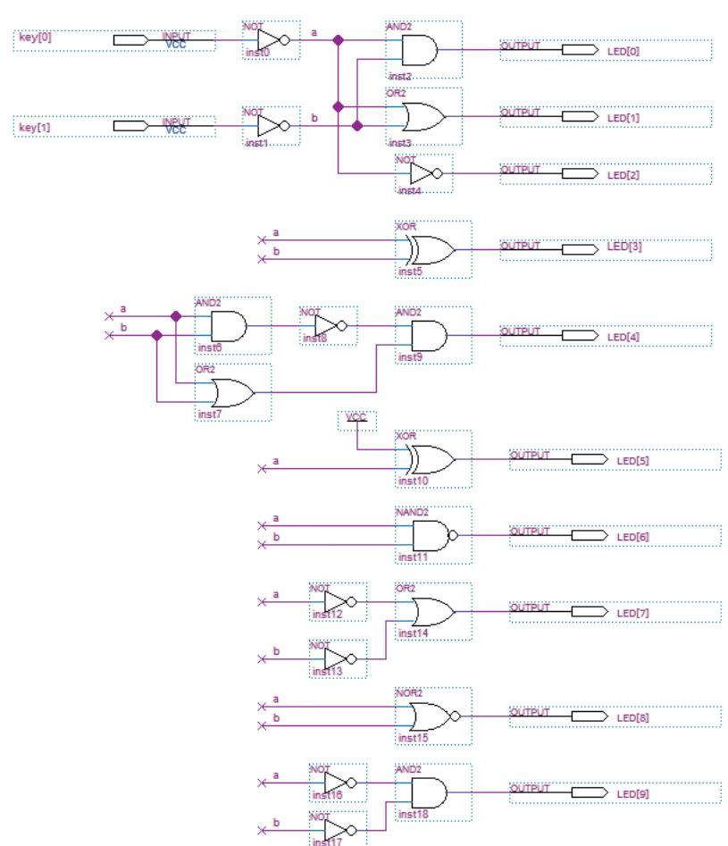

# Задания по 1 главе книги ["ЦИФРОВОЙ СИНТЕЗ: ПРАКТИЧЕСКИЙ КУРС"](https://dmkpress.com/catalog/electronics/circuit_design/978-5-97060-850-0/)


## Схематичная функция (lab_1)



### Таблица истинности
| a | 0 | 0 | 1 | 1 |
| --- | --- | --- | --- | --- |
| b | 0 | 1 | 0 | 1 |
| LED[0] | 0 | 0 | 0 | 1 |
| LED[1] | 0 | 1 | 1 | 1 |
| LED[2] | 1 | 1 | 0 | 0 |
| LED[3] | 0 | 1 | 1 | 0 |
| LED[4] | 0 | 1 | 1 | 0 |
| LED[5] | 1 | 1 | 0 | 0 |
| LED[6] | 1 | 1 | 1 | 0 |
| LED[7] | 1 | 1 | 1 | 0 |
| LED[8] | 1 | 0 | 0 | 0 |
| LED[9] | 1 | 0 | 0 | 0 |

### Quartus Project
```Batch
> cd 2022-digital-design\autumn\part_1
> .\make_quartus_project.bat  .\de10-lite\lab_1
```


## Функция в HDL (lab_1_hdl)
### Quartus Project
```Batch
> cd 2022-digital-design\autumn\part_1
> .\make_quartus_project.bat  .\de10-lite\lab_1_hdl
```

### Icarus + GTKWave Simulation
```Batch
> cd 2022-digital-design\autumn\part_1
> .\simulate_with_icarus.bat  .\de10-lite\lab_1_hdl\ lab_1.v
```


## Упражнение 1.10.1 - Основное задание (task_1)

```
Составьте таблицу истинности для приведенного ниже уравнения.
Используя схемотехнический редактор и язык Verilog, реализуйте указанное ниже уравнение.
Напишите тестбенч для проверки работоспособности устройства.
Используя переключатели и светодиоды, проверьте работоспособность проектов на отладочной плате.

1. y = ~(x1x2) + x3~x4 + x1x3x4 + x3;
```

### Таблица истинности
| x1 | x2 | x3 | x4 | y |
| --- | --- | --- | --- | --- |
| 0 | 0 | 0 | 0 | 1 |
| 0 | 0 | 0 | 1 | 1 |
| 0 | 0 | 1 | 0 | 1 |
| 0 | 0 | 1 | 1 | 1 |
| 0 | 1 | 0 | 0 | 1 |
| 0 | 1 | 0 | 1 | 1 |
| 0 | 1 | 1 | 0 | 1 |
| 0 | 1 | 1 | 1 | 1 |
| 1 | 0 | 0 | 0 | 1 |
| 1 | 0 | 0 | 1 | 1 |
| 1 | 0 | 1 | 0 | 1 |
| 1 | 0 | 1 | 1 | 1 |
| 1 | 1 | 0 | 0 | 0 |
| 1 | 1 | 0 | 1 | 0 |
| 1 | 1 | 1 | 0 | 1 |
| 1 | 1 | 1 | 1 | 1 |

### Quartus Project
```Batch
> cd 2022-digital-design\autumn\part_1
> .\make_quartus_project.bat  .\de10-lite\task_1
```

### Icarus + GTKWave Simulation
```Batch
> cd 2022-digital-design\autumn\part_1
> .\simulate_with_icarus.bat  .\de10-lite\task_1\ task_1.v
```
